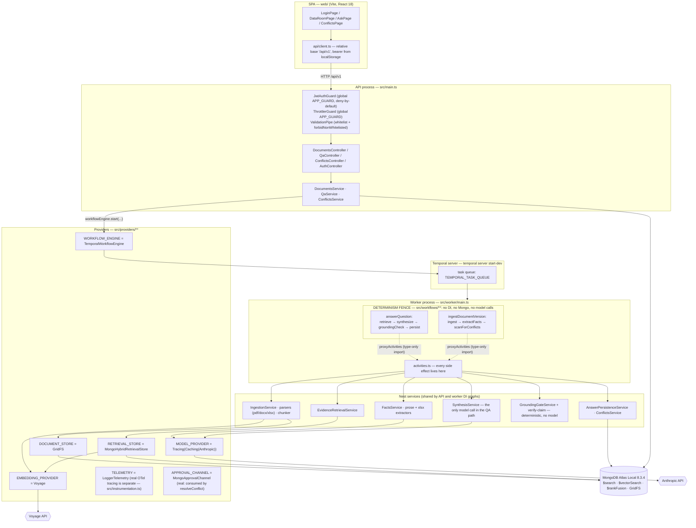
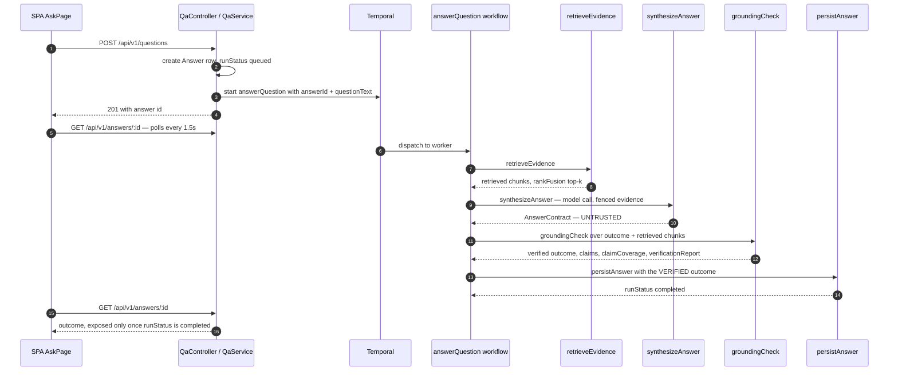

# Architecture

Two runtime processes over one database, plus a Temporal server.

- **API process** (`src/main.ts`) — NestJS HTTP, terminates auth, validates requests, writes the
  first row, and hands long work to Temporal. It never runs a model call itself.
- **Worker process** (`src/worker/main.ts`) — boots the same Nest DI graph (`WorkerModule`), polls
  the Temporal task queue, and runs both workflows' activities. Every model call, embedding call,
  parse, and database write in the evidence pipeline happens here.

Both processes read the same Mongo (`mongodb/mongodb-atlas-local`), which is where hybrid retrieval
lives: `$search` + `$vectorSearch` fused by `$rankFusion`
(`src/providers/retrieval/mongo-hybrid.store.ts`).

## System shape

### Reading the determinism boundary

`src/workflows/**` is deterministic orchestration and nothing else. It is enforced twice:

1. **ESLint zone** (`eslint.config.mjs`, `eslint-rules/determinism-fence.cjs`) — a
   `no-restricted-imports` block over `src/workflows/**` rejects Nest DI, Mongoose, and the
   Temporal client/worker APIs. Fast CI signal; proven to reject by
   `test/eslint/determinism-fence.spec.ts`.
2. **The workflow bundler** inside `Worker.create` (`src/worker/main.ts`) — webpack resolves the
   whole module graph and rejects a forbidden import reached transitively, which the lint zone
   cannot see. This is the gate that actually holds; `test/worker/determinism-fence.spec.ts`
   covers it.

Workflow files import `Activities` with `import type` only, so the statement is erased before the
bundler sees a graph — that is why `answer-question.workflow.ts` can name an activity that pulls in
mongoose without pulling mongoose into the workflow bundle.

**Probabilistic work is confined to activities.** `synthesizeAnswer` and `extractFacts` are the only
two activities that call a model; `retrieveEvidence` and the ingestion path call the embedding
provider. The grounding check is an activity too, but a pure one — no model, no network, no
database read beyond the scoped fact/conflict lookups it is handed.

## The answer path, and where the gate sits

Two things this diagram is making explicit:

- What gets persisted is `grounding.outcome`, never the model's raw `outcome`
  (`src/workflows/answer-question.workflow.ts`). The model proposes; the application disposes.
- `claimCoverage`, `verificationReport`, and `droppedClaims` are absent from
  `answerContractSchema` — the schema the model's structured output is constrained to
  (`src/features/evidence/qa/contracts/answer.contract.ts`). The model has no field to write them
  into, so it cannot forge its own verification result.

## Provider bindings, and which are fakes today

`src/providers/providers.module.ts` is the whole binding table.

| Token               | Bound to                                  | Real? |
| ------------------- | ----------------------------------------- | ----- |
| `MODEL_PROVIDER`    | `TracingModelProvider(CachingModelProvider(AnthropicModelProvider))` | Real. Cache mode is `'off'` by default — record/replay is a call-site decision made by `eval/bootstrap.ts`, not a boot-time one. |
| `EMBEDDING_PROVIDER`| `VoyageEmbeddingProvider`                 | Real. |
| `RETRIEVAL_STORE`   | `MongoHybridRetrievalStore`               | Real. |
| `DOCUMENT_STORE`    | `GridFsDocumentStore`                     | Real. |
| `WORKFLOW_ENGINE`   | `TemporalWorkflowEngine`                  | Real. Overridden back to `FakeWorkflowEngine` in `test/utils/create-test-app.ts` so no e2e dials a live server. |
| `TELEMETRY`         | `LoggerTelemetry`                         | Real, for structured events — but separate from tracing. OpenTelemetry itself is wired independently in `src/instrumentation.ts` (http/express/mongoose instrumentations, spans to Jaeger and `artifacts/traces/`); `TELEMETRY` is not that pipeline, it is a logger the two coexist alongside. |
| `APPROVAL_CHANNEL`  | `MongoApprovalChannel`                    | Real, and consumed: the `resolveConflict` workflow (`src/workflows/resolve-conflict.workflow.ts`) requests an approval through it and blocks on `getApprovalDecision` until a human decides. |

`FakeModelProvider`, `FakeEmbeddingProvider`, `FakeRetrievalStore`, and `FakeDocumentStore` also
exist, but they are bound directly by unit tests, not through this module.

## Retrieval

`RETRIEVAL_FUSION` selects where reciprocal-rank fusion runs:

- `server` (default) — one `$rankFusion` aggregation with two input pipelines (`$search` lexical,
  `$vectorSearch` dense), equal weights, `scoreDetails: true`.
- `app` — the two pipelines run as standalone aggregations and the same RRF formula
  (`k = 60`, identical weights) is applied in code.

Both paths return the same hit shape, which is what makes the two comparable in an eval run. Tenant
scoping happens **inside** each input pipeline, never as a `$match` on the fused output — filtering
after fusion would rank a candidate set that includes other tenants' evidence and then discard most
of it, changing which chunks reach the final top-k.

Index definitions live in `migrations/0003-search-indexes.ts`; the store duplicates the index names
rather than importing them (`tsconfig.build.json` scopes `rootDir` to `src`), and
`test/features/evidence/retrieval/search-indexes.integration-spec.ts` is what keeps the two
definitions honest against a live server.

## Related

- [`threat-model.md`](./threat-model.md) — controls, enforcing code, and residual risk.
- `docs/adr/0002-single-store-hybrid-retrieval.md` — why one store rather than a separate vector DB.
- `docs/adr/0003-temporal-from-day-one.md` — the determinism fence and the two-process split.
- `docs/adr/0004-grounding-gate-and-citation-contract.md` — what the gate does and does not verify.
- `docs/adr/0005-deterministic-authz-and-tool-chokepoint.md` — the tool chokepoint, and why it has
  no caller yet.
