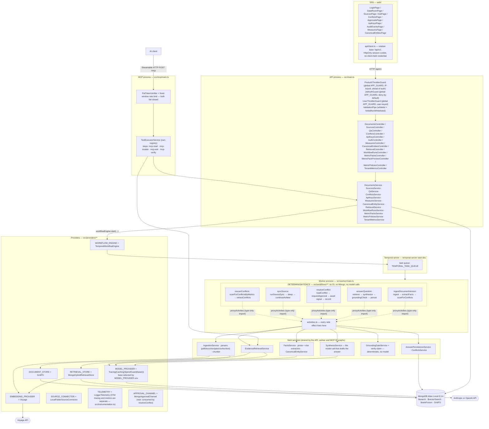
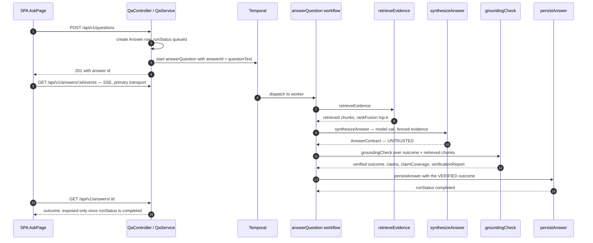

# Architecture

Three runtime processes over one database, plus a Temporal server.

- **API process** (`src/main.ts`) — NestJS HTTP, terminates auth, validates requests, writes the
  first row, and hands long work to Temporal. It never runs a model call itself.
- **Worker process** (`src/worker/main.ts`) — boots the same Nest DI graph (`WorkerModule`), polls
  the Temporal task queue, and runs every workflow's activities. Every model call, embedding call,
  parse, and database write in the evidence pipeline happens here.
- **MCP process** (`src/mcp/main.ts`) — a narrow, PAT-authenticated tool surface for AI clients.
  Serves Streamable HTTP from a hand-built Express app over the `McpModule` DI slice, and
  implements no behaviour of its own: every tool call routes through `ToolExecutorService` —
  the deterministic authorization chokepoint (ADR-0005) — and lands on the same service methods the
  REST controllers call. See [The MCP surface](#the-mcp-surface).

All three read the same Mongo (`mongodb/mongodb-atlas-local`), which is where hybrid retrieval
lives: `$search` + `$vectorSearch` fused by `$rankFusion`
(`src/providers/retrieval/mongo-hybrid.store.ts`).

## System shape



### Reading the determinism boundary

`src/workflows/**` is deterministic orchestration and nothing else. It is enforced twice:

1. **ESLint zone** (`eslint.config.mjs`, `eslint-rules/determinism-fence.cjs`) — a
   `no-restricted-imports` block over `src/workflows/**` rejects Nest DI, Mongoose, and the
   Temporal client/worker APIs. Fast CI signal; proven to reject by
   `test/eslint/determinism-fence.spec.ts`.
2. **The workflow bundler** inside `Worker.create` (`src/worker/main.ts`) — webpack resolves the
   whole module graph and rejects a forbidden import reached transitively, which the lint zone
   cannot see. This is the gate that actually holds; `test/worker/determinism-fence.spec.ts`
   covers it.

Workflow files import `Activities` with `import type` only, so the statement is erased before the
bundler sees a graph — that is why `answer-question.workflow.ts` can name an activity that pulls in
mongoose without pulling mongoose into the workflow bundle.

**Probabilistic work is confined to activities.** `synthesizeAnswer` and `extractFacts` are the
activities that call a model; `retrieveEvidence` and the ingestion path call the embedding provider.
The grounding check is an activity too, but a pure one — no model, no network, no database read
beyond the scoped fact/conflict lookups it is handed.

## The answer path, and where the gate sits



Two things this diagram is making explicit:

- What gets persisted is `grounding.outcome`, never the model's raw `outcome`
  (`src/workflows/answer-question.workflow.ts`). The model proposes; the application disposes.
- `claimCoverage`, `verificationReport`, and `droppedClaims` are absent from
  `answerContractSchema` — the schema the model's structured output is constrained to
  (`src/features/evidence/qa/contracts/answer.contract.ts`). The model has no field to write them
  into, so it cannot forge its own verification result.

`AskPage` opens the stream before it has anything to show and never reopens it once opened — a
completed answer closes the connection server-side, and the client treats that as a clean finish
rather than a dropped one. Polling `GET /api/v1/answers/:id` only runs once the stream has given up
(a server-authored error frame, exhausted reconnect attempts, or no `EventSource` at all) and stops
the moment `runStatus` reaches a terminal value. See [Live updates](#live-updates-server-sent-events)
for the other two streams and the controls shared across all three.

## Provider bindings, and which are fakes today

`src/providers/providers.module.ts` is the whole binding table.

| Token               | Bound to                                  | Real? |
| ------------------- | ----------------------------------------- | ----- |
| `MODEL_PROVIDER`    | `TracingModelProvider(CachingModelProvider(SpendGuardModelProvider(base)))`, `base` = `AnthropicModelProvider` or `OpenAiModelProvider` | Real. See [Model provider selection and the spend ceiling](#model-provider-selection-and-the-spend-ceiling). Cache mode is `'off'` by default — record/replay is a call-site decision made by `eval/bootstrap.ts`, not a boot-time one. |
| `EMBEDDING_PROVIDER`| `VoyageEmbeddingProvider`                 | Real. |
| `RETRIEVAL_STORE`   | `MongoHybridRetrievalStore`               | Real. |
| `DOCUMENT_STORE`    | `GridFsDocumentStore`                     | Real. |
| `SOURCE_CONNECTOR`  | `LocalFolderSourceConnector`              | Real. One connector implementation today; the seam (ADR-0012) is what a second one plugs into. |
| `WORKFLOW_ENGINE`   | `TemporalWorkflowEngine`                  | Real. Overridden back to `FakeWorkflowEngine` in `test/utils/create-test-app.ts` so no e2e dials a live server. |
| `TELEMETRY`         | `LoggerTelemetry`                         | Real, for structured events — but separate from tracing and metrics. OpenTelemetry itself is wired independently in `src/instrumentation.ts` (http/express/mongoose instrumentations, spans to Jaeger and `artifacts/traces/`, plus a Prometheus metric reader); `TELEMETRY` is not that pipeline, it is a logger the two coexist alongside. |
| `APPROVAL_CHANNEL`  | `MongoApprovalChannel`                    | Real, and consumed: the `resolveConflict` workflow (`src/workflows/resolve-conflict.workflow.ts`) requests an approval through it and blocks on `getApprovalDecision` until a human decides. |

`FakeModelProvider`, `FakeEmbeddingProvider`, `FakeRetrievalStore`, and `FakeDocumentStore` also
exist, but they are bound directly by unit tests, not through this module.

## Model provider selection and the spend ceiling

`createModelProvider` (exported from `providers.module.ts` so the selection and the chain order are
testable without booting the Mongoose-backed graph) picks the base provider from
`config.model.provider` — `openai` selects `OpenAiModelProvider`, anything else selects
`AnthropicModelProvider` — and wraps it in a fixed chain:

```text
TracingModelProvider( CachingModelProvider( SpendGuardModelProvider( base ) ) )
```

The order is load-bearing in one direction. **SpendGuard sits inside Caching**, so a replay-cache
hit never reaches it and never consumes budget. Inverted, every cached replay would reserve and
settle money that was never spent, and an eval run replaying hundreds of cached calls would exhaust
a tenant's daily ceiling for free.

The three decorators take a `ModelProvider`/`Telemetry` positionally rather than through an
`@Inject()`-tagged constructor, which is why they are assembled by a factory rather than bound with
`useClass`. Only the two base providers are ordinary class providers.

### The aggregate ceiling

Two independent bounds exist, and they answer different questions. Each `ModelRequest` carries its
own `maxCostUsd`, which bounds one call. `SpendGuardModelProvider` plus `TenantSpendService` bound
the **sum** of every model call one tenant makes in a UTC day, against
`MODEL_SPEND_DAILY_LIMIT_USD`.

The ledger is a `ModelSpendWindow` document keyed by `(tenantId, windowStart)`, and the guard is a
reserve/settle pair around the delegate call:

1. `reserve` upserts the window document, then does the budget check and the increment as one
   `findOneAndUpdate` whose filter carries an `$expr` matching only when
   `spentUsd + reservedUsd + amount` still fits under the limit. A read followed by a separate write
   would leave a window in which a concurrent caller's reservation is invisible; this closes it.
   That second update deliberately does **not** upsert — an upsert on an `$expr` filter would mint a
   fresh zero-balance row whenever the check fails, satisfying it trivially.
2. The delegate runs. On success `settle` moves the reservation into `spentUsd` at the actual cost;
   on any throw `release` returns it. Both take back the `windowStart` `reserve` returned rather
   than recomputing one, so a call spanning UTC midnight settles against the window it reserved.

Failure direction: **closed**, because the thing being gated is money leaving the account and is
irreversible once the delegate call runs. A request that arrives with no `tenantId` is refused
outright rather than run unmetered or charged to the wrong tenant. The single deliberate fail-open
path is a configured limit of zero or less, which disables the aggregate ceiling for a tenant that
was never given one.

## Retrieval

`RETRIEVAL_FUSION` selects where reciprocal-rank fusion runs:

- `server` (default) — one `$rankFusion` aggregation with two input pipelines (`$search` lexical,
  `$vectorSearch` dense), equal weights, `scoreDetails: true`.
- `app` — the two pipelines run as standalone aggregations and the same RRF formula
  (`k = 60`, identical weights) is applied in code.

Both paths return the same hit shape, which is what makes the two comparable in an eval run. Tenant
scoping happens **inside** each input pipeline, never as a `$match` on the fused output — filtering
after fusion would rank a candidate set that includes other tenants' evidence and then discard most
of it, changing which chunks reach the final top-k.

Index definitions live in `migrations/0003-search-indexes.ts`; the store duplicates the index names
rather than importing them (`tsconfig.build.json` scopes `rootDir` to `src`), and
`test/features/evidence/retrieval/search-indexes.integration-spec.ts` is what keeps the two
definitions honest against a live server.

`GET /api/v1/retrieval/search` (`src/features/evidence/retrieval/retrieval.controller.ts`) is the
one browser-reachable path onto this fusion directly — `RetrievalService` calls the same
`EvidenceRetrievalService.retrieve` the answer workflow's `retrieveEvidence` activity calls, with no
grounding gate or citation contract in between, since there is no model output here to check. It is
the only ungated path to raw corpus text on the browser surface, so `RolesGuard` gates it explicitly
(`@RequireRole(Member, Admin)`) rather than relying on the guard's default, and it carries its own
per-tenant `@Throttle()` window narrower than the global default, because every call spends a live
embedding request. `SearchPage` is the SPA consumer. MCP's `search_evidence` tool reaches the same
`EvidenceRetrievalService` through a different path — `ToolExecutorService`, not `RolesGuard` — so
the two entry points enforce the access floor with different mechanisms over the same read.

## Evidence lifecycle: sync, quarantine and withdrawal

Ingestion's status set is four states: `pending | completed | failed | needs-ocr`
(`DOCUMENT_VERSION_INGESTION_STATUSES`, `document-version.schema.ts`). `needs-ocr` is a terminal
quarantine, not a variant of `failed` — `PdfParser` reaches it only for a scanned PDF with at least
one page and no extractable text on any of them (`EmptyPdfTextLayerException`), a condition that is
deterministic for the same bytes, so `ingest-document-version.workflow.ts` marks it non-retryable.
Every other throw during ingestion still resolves to `failed`.

`syncSource`'s recurring loop (`SourcesService.runSync`) diffs each sweep's fresh file listing
against the source's known `fileStates` and can soft-withdraw a `DocumentVersion` whose file is no
longer present — `withdrawnAt`/`withdrawnReason` on the version, chunks and facts left untouched.
Three guards sit between an absent path and an actual withdrawal, and all three fail toward
retention: an empty listing against known non-empty state suppresses withdrawal outright (an
unmounted mountpoint's `listFiles` returns `[]` successfully, indistinguishable from a genuinely
emptied source); more than half of the source's active known paths absent in one sweep suppresses
it too (a proportional circuit breaker for a partial mount the empty check alone would miss); and a
path must be absent on two consecutive sweeps, not one, before it withdraws (closing the
write-temp-then-rename window a single-sweep absence would misread as deletion). `Source` records
when a guard suppressed withdrawal (`lastWithdrawalSuppressedAt`/`Reason`), so the outcome is
visible rather than silent. `EvidenceRetrievalService.retrieve` is where the exclusion is actually
enforced — over-fetching past the store, then filtering out any hit whose owning version carries
`withdrawnAt` — because none of `$search`'s filter, `$vectorSearch`'s filter (today scoped to
`tenantId` alone), or a post-fusion `$match` can express "join to `document_versions` and drop
these" without a candidate pool made entirely of withdrawn hits coming back as zero results with no
signal why. Withdrawal is retrieval exclusion, not deletion: a withdrawn version's chunks and facts
stay retained so a past `Answer` can still be explained and `ResolutionBacktestService` can still
replay a resolution that cited them. The separate, admin-gated hard-delete path
(`DocumentsController.remove`) exists for an operator who wants the bytes actually gone. See
[`0024-evidence-lifecycle-and-withdrawal.md`](../adr/0024-evidence-lifecycle-and-withdrawal.md) for
the full design, including the guard thresholds and the accepted costs.

## Metric packs: versioned detection config

Conflict detection and survivorship no longer read a single hardcoded ontology. Every tenant
resolves a `MetricPackData` (`MetricPacksService.resolveActive`) — either its own authored, activated
`MetricPack` row, or the code default `CRE_PACK_V1`, which re-exports `metric-ontology.ts`'s
`METRIC_ONTOLOGY` byte-identically under the pack shape. Both extraction (`FactsService.extractFacts`)
and detection (`ConflictsService.scanForConflicts`/`scanForConflictsByMetrics`) resolve the active
pack once per call and stamp the resulting `packId`/`packVersion` onto every `ExtractedFact`/`Conflict`
they write, so a row always says which pack's tolerance and units judged it.

Authoring is a three-step admin lifecycle — `MetricPacksController`'s `createDraft` → `publish` →
`activate` — not a direct field edit. `publish` refuses a draft that would silently drop a parent
metric without acknowledgement, or that changes a surviving metric's canonical unit or any unit's
conversion factor: a tolerance edit only governs the *next* scan and is safe to version, but a unit
factor is re-applied to every historical fact on every scan, so an edit there would silently
reinterpret history rather than just steer the future. `activate` scopes its rescan to exactly the
metric ids `diffDetectionRelevantMetrics` reports changed — a labels-or-aliases-only version starts no
rescan at all — and `MetricPackPreviewController` (`ConflictsModule`, routed under the same
`/metric-packs` prefix as `MetricPacksController` to avoid a module cycle) exposes the identical diff
as a preview before any version is ever activated. See
[`0025-versioned-metric-packs.md`](../adr/0025-versioned-metric-packs.md) for the full design,
including why tolerance and unit arithmetic are versioned asymmetrically.

## Live updates: Server-Sent Events

Three routes stream over `@Sse()` rather than returning once: `GET /api/v1/answers/:id/events`
(`QaController`), `GET /api/v1/documents/events` (`DocumentsController`), and
`GET /api/v1/workflow-runs/:id/events` (`WorkflowRunsController`). All three are authenticated like
any other route — SSE has no separate credential — and all three share two controls from
`src/shared/utils/stream-session.util.ts`: `acquireStreamSlot` caps concurrent open connections per
tenant and per user, refusing a new one with 429 once the configured ceiling is already held, and
`reauthTicks$` closes a connection if the underlying user row is deleted or moves tenant while the
stream is open.

The three routes are not otherwise uniform. `streamAnswer` and `streamRun` terminate themselves once
their subject's `runStatus` reaches `completed` or `failed`, and carry no independent time bound
beyond that — a run that never reaches a terminal status holds its slot until the client disconnects.
`streamList` (`documents/events`) has no terminal status of its own to close on, so it alone also
carries a bare `SseConfig.maxStreamLifetimeMs` ceiling. See
[`0019-stream-lifecycle-and-throttle-keying.md`](../adr/0019-stream-lifecycle-and-throttle-keying.md)
for the per-route reasoning and `threat-model.md` §9 for the residual risk this leaves.

## The MCP surface

`src/mcp/**` is a third process, not a route on the API. It boots `McpModule` — a DI slice pulling
`ApiKeysModule` (for `TOKEN_VERIFIER`), `QaModule`, and `ConflictsModule` — via
`createApplicationContext`, then layers a plain Express app on top by hand, because Streamable HTTP
is an HTTP concern an application context does not provide. There is no `AuthModule`, no
`ThrottlerModule`, and no global guard in this process; it supplies its own equivalents and they are
listed below.

**Stateless.** `sessionIdGenerator` is `undefined`, so no session is ever issued. One `Server` and
one `StreamableHTTPServerTransport` are built per request and closed with it, which is what makes it
structurally impossible for one caller's identity to reach another caller's tool call. Streamable
HTTP's `GET` (server-initiated stream) and `DELETE` (session termination) apply only to stateful
mode and both answer 405.

**Two gates, both fail closed, both before any protocol work:**

1. `PatTokenVerifier` resolves `Authorization: Bearer <token>` through `ApiKeysService`. A missing
   header, a wrong scheme, or a token that is unknown, revoked, or expired all resolve to `null` and
   the request is refused. There is no cookie fallback — this surface has no browser session to read
   one from. The resulting `ToolExecutionContext` is built entirely from the verified token; nothing
   in it comes from the request body.
2. A fixed-window rate limiter, per verified `actorId`, against `MCP_RATE_LIMIT_PER_MINUTE`. It is
   charged per JSON-RPC request present in the body rather than per HTTP POST, because the SDK
   dispatches every request inside a batch array — a flat per-POST charge would let one call trigger
   an arbitrary number of tool executions for one unit of budget. Counters are in-memory and
   per-process: correct for a single replica, wrong for horizontal scale-out.

**Five tools, four steps.** `tools/list` advertises `search_evidence`, `get_answer`,
`request_resolution`, `ask_evidence`, and `verify_claims` (the last three withheld when the
tenant's daily spend ceiling is disabled — see `SPEND_GATED_TOOL_DEFINITIONS`,
`src/mcp/mcp-server.service.ts`), each from the same zod schema `ToolExecutorService` validates
against, so the advertised JSON Schema cannot drift from what is enforced. `tools/call` routes
through this process's own `ToolExecutorService` instance under one of four disjoint steps,
`stepForTool` picking the step by tool name:

| Step         | Tools                                | Minimum role |
| ------------ | ------------------------------------ | ------------ |
| `mcp-read`   | `search_evidence`, `get_answer`      | Member       |
| `mcp-mutate` | `request_resolution`                 | Admin        |
| `mcp-ask`    | `ask_evidence`                       | Member       |
| `mcp-verify` | `verify_claims`                      | Member       |

The steps are kept disjoint so a read-capable token, a mutating one, and the two spend-metered ones
stay distinguishable in policy — `mcp-ask` and `mcp-verify` share `mcp-read`'s Member floor today,
but each is policed by its own map entry, so either can move independently later. An unrecognized
tool name defaults to the read step and is then refused downstream as unregistered — the default
direction never widens toward the mutating, ask, or verify step. A chokepoint refusal comes back as
an ordinary tool result carrying the refusal reason (`isError: true`), not a thrown protocol error a
caller cannot tell from a transport failure.

**Approvals are deliberately absent.** There is no tool that approves, rejects, or resolves
anything. `request_resolution` starts the same `resolveConflict` workflow the SPA's button starts,
and that workflow parks on a human's durable approval; the proposal is tagged with an `mcp` origin
so the approver can see it arrived from the AI-reachable surface rather than an interactive session.
Nothing in this process can advance an approval.

Each `tools/call` runs inside a fresh AsyncLocalStorage scope carrying the verified actor and
tenant, mirroring what the worker does for activities, so audit stamping behaves exactly as it does
for a request that came through `JwtAuthGuard` — even though nothing here runs behind that guard.

This is a deployable process, not a development script. `npm run mcp:dev` runs it on the host loop;
`docker-compose.yml` carries an `mcp` service under the `full` profile that runs the same compiled
entrypoint, binds container port 3002, publishes `${MCP_HOST_PORT:-3002}`, and waits on `mongo`,
`temporal` and `migrate` exactly as `api` and `worker` do — `request_resolution` and `ask_evidence`
both start a workflow, so this surface is unusable without Temporal even though it runs no worker
itself. Its port is
published because an MCP client is by definition outside the compose network; the PAT check is the
only thing gating who reaches it.

## Metrics and alerting

Tracing answers what happened in one request. It has no notion of a rate crossing a threshold, and
the failures this system is built around — a claim dropped by the gate, an empty retrieval, an
approval nobody answered — each produce a response that looks normal to the caller. What separates
routine from broken is the rate, so those live in metrics.

`src/instrumentation.ts` runs a `PrometheusExporter` alongside the trace exporters, on
`METRICS_PORT`. All three processes share that one variable and derive a distinct port from it by a
per-service offset keyed on `OTEL_SERVICE_NAME` — API, worker one above, MCP two above — rather than
each needing an env var of its own that could drift out of sync.
`observability/prometheus/prometheus.yml` scrapes all three. A process whose service name is not in
the map serves no metrics at all and says so on stderr: measurement fails **open**, because a gap in
metrics must never stop the thing it measures, and falling back to the shared base port would put
two exporters on one port where the loser is silent.

`src/providers/telemetry/domain-metrics.ts` declares five instruments off a module-scope meter:

| Instrument                            | Emitted by                                            |
| ------------------------------------- | ----------------------------------------------------- |
| `evidence_ops.grounding.claims_dropped` | `GroundingGateService.verify`, attributed by violation rule |
| `evidence_ops.retrieval.empty`        | `EvidenceRetrievalService.retrieve` returning no chunks |
| `evidence_ops.workflow_run.failed`    | `IngestionService`'s failure recording                 |
| `evidence_ops.approval.timeout`       | `ConflictsService.recordResolution`'s `timed_out` branch |
| `evidence_ops.model.cost_usd`         | `TracingModelProvider.generate`, per call (histogram)   |

The meter is module-scope and resolves to the OTel API's no-op provider until a real SDK starts, so
these are inert rather than conditional in a test — there is no test-only branch anywhere in that
file or its callers. Every attribute is drawn from a small fixed set (a violation rule, a provider
name, a task class). Never a tenant id, a document id, or any text a user or model produced: a
metrics backend aggregates by attribute value, so a free-text attribute would be both a cardinality
explosion and a content leak into a system this codebase does not otherwise send documents to.

`observability/prometheus/alert-rules.yml` defines six rules over those series plus Prometheus's
own `up`. `WorkerDown` and `McpDown` depend on no application code emitting anything, which makes
them the two rules provably testable by stopping a container. `GroundingRejectSpike` compares a short window against
the metric's own trailing baseline rather than an absolute count, because a fixed threshold at pilot
volume either fires on a quiet day's single rejection or misses a spike on a busy one. Every alert
annotation names a concrete first step. Note the exporter's naming: `.` becomes `_` and monotonic
counters gain a `_total` suffix, so `evidence_ops.grounding.claims_dropped` is queried as
`evidence_ops_grounding_claims_dropped_total`.

## Related

- [`threat-model.md`](./threat-model.md) — controls, enforcing code, and residual risk.
- [`pilot-runbook.md`](./pilot-runbook.md) — operating the single-host deployment.
- `docs/adr/0002-single-store-hybrid-retrieval.md` — why one store rather than a separate vector DB.
- `docs/adr/0003-temporal-from-day-one.md` — the determinism fence and the process split.
- `docs/adr/0004-grounding-gate-and-citation-contract.md` — what the gate does and does not verify.
- `docs/adr/0005-deterministic-authz-and-tool-chokepoint.md` — the tool chokepoint the MCP surface
  executes through.
- `docs/adr/0006-model-access-behind-a-decorated-provider.md` — why model access sits behind a
  decorator chain rather than a direct SDK call.
- `docs/adr/0012-source-connector-seam.md` — the connector seam behind `SOURCE_CONNECTOR`.
- `docs/adr/0015-agentic-retrieval-mode.md` — superseded; the removed multi-turn retrieval loop's
  design rationale, kept as a historical record.
- `docs/adr/0016-mcp-server-surface.md` — the MCP surface, its four steps (amended by ADR-0023,
  which added `mcp-ask`/`mcp-verify` to the original two), and why approvals are not reachable from
  it.
- `docs/adr/0017-survivorship-policy.md` — the deterministic rules that propose a conflict winner.
- `docs/adr/0018-metrics-and-alerting-shape.md` — the six signals and why there are not more.
- `docs/adr/0019-stream-lifecycle-and-throttle-keying.md` — the three SSE streams' shared controls
  and the one that is not shared.
- `docs/adr/0024-evidence-lifecycle-and-withdrawal.md` — sync absence guards, soft withdrawal, and
  the scanned-PDF quarantine state.
- `docs/adr/0025-versioned-metric-packs.md` — versioned metric packs, the `rescanConflicts` workflow,
  and why tolerance is editable but unit arithmetic is not.
